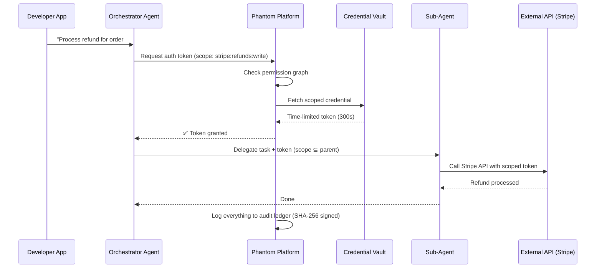
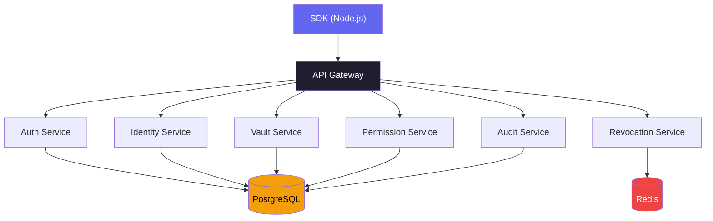

# 🔐 Phantom — Complete Startup Masterplan

---

## 1. Explain It Like I'm 5

Imagine you have a bunch of **robot helpers** (AI agents). One robot can send emails, another can charge credit cards, another can read your calendar.

**The problem:** Right now, you give each robot ALL your keys to EVERYTHING. The email robot also has your credit card key. If the email robot goes crazy, it can charge people money. 😱

**Phantom is the keychain manager.**

- Each robot gets its **own name tag** (identity) — so you always know WHO did WHAT
- Each robot gets **only the keys it needs** — email robot gets email key, NOT credit card key
- Keys **expire automatically** — like a hall pass that only works for 5 minutes
- Everything is **written in a diary** (audit log) — you can see every door every robot opened
- You have a **big red button** (kill switch) — if a robot goes crazy, press it, ALL its keys stop working instantly

```
WITHOUT Phantom:                    WITH Phantom:

Robot → 🔑🔑🔑🔑 ALL keys          Robot → Phantom → 🔑 only email key
  😱 "I can do anything!"             ✅ "I can only send emails"
                                       ⏰ "And only for 5 minutes"
                                       📝 "And everything I do is logged"
```

---

## 2. How the Flow Works



### Flow in Plain English

1. **Developer's app** tells the orchestrator agent: "Do a task"
2. **Orchestrator** asks Phantom: "Can I access Stripe refunds?"
3. **Phantom** checks the permission graph → ✅ allowed
4. **Phantom** creates a **temporary token** (expires in 5 min) from the vault
5. **Orchestrator** can delegate to a **sub-agent**, but only with EQUAL or FEWER permissions
6. **Sub-agent** uses the token to call Stripe
7. **Everything** is logged with SHA-256 signatures — tamper-proof

---

## 3. MVP Architecture

### What to Build for V1

> [!IMPORTANT]
> Build ONLY these 6 core services. Nothing else until you have paying users.



### Tech Stack

| Layer             | Technology                 | Why                                          |
| ----------------- | -------------------------- | -------------------------------------------- |
| **API**           | Node.js + Fastify          | Fast, developer-friendly                     |
| **Database**      | PostgreSQL                 | Relational data, JSONB for flexible schemas  |
| **Cache**         | Redis                      | Token revocation checks (must be instant)    |
| **SDK**           | TypeScript                 | Primary audience is JS/TS developers         |
| **Auth**          | JWT + API Keys             | Standard, well-understood                    |
| **Crypto**        | Ed25519 signing            | For agent identity certificates              |
| **Audit Storage** | Append-only Postgres table | Immutable log, later move to dedicated store |
| **Hosting**       | Railway or Fly.io          | Simple, cheap, scalable                      |
| **Docs**          | Mintlify or Docusaurus     | Beautiful developer docs                     |

### Database Schema (Core Tables)

```sql
-- Agent Identity
CREATE TABLE agents (
    id          TEXT PRIMARY KEY,  -- agt_7x2kQf...
    org_id      TEXT NOT NULL,
    name        TEXT,
    model       TEXT,              -- gpt-4, claude-3, etc.
    version     TEXT,
    public_key  TEXT,              -- Ed25519 public key
    created_by  TEXT,              -- user who created it
    created_at  TIMESTAMPTZ DEFAULT NOW(),
    revoked_at  TIMESTAMPTZ       -- NULL = active
);

-- Credential Vault
CREATE TABLE credentials (
    id          TEXT PRIMARY KEY,
    org_id      TEXT NOT NULL,
    service     TEXT NOT NULL,     -- 'stripe', 'twilio', etc.
    encrypted_key BYTEA NOT NULL, -- AES-256 encrypted
    created_at  TIMESTAMPTZ DEFAULT NOW()
);

-- Permission Graph
CREATE TABLE permissions (
    id          TEXT PRIMARY KEY,
    agent_id    TEXT REFERENCES agents(id),
    resource    TEXT NOT NULL,     -- 'stripe:invoices'
    action      TEXT NOT NULL,     -- 'read', 'write'
    requires_approval BOOLEAN DEFAULT FALSE
);

-- Audit Ledger (append-only)
CREATE TABLE audit_log (
    id          BIGSERIAL PRIMARY KEY,
    agent_id    TEXT NOT NULL,
    credential_id TEXT,
    action      TEXT NOT NULL,
    resource    TEXT,
    result      TEXT,              -- 'success', 'denied', 'error'
    reasoning   TEXT,              -- agent's reasoning
    hash        TEXT NOT NULL,     -- SHA-256 of this entry
    prev_hash   TEXT,              -- hash of previous entry (chain)
    created_at  TIMESTAMPTZ DEFAULT NOW()
);

-- Scoped Tokens
CREATE TABLE tokens (
    id          TEXT PRIMARY KEY,
    agent_id    TEXT REFERENCES agents(id),
    scopes      JSONB NOT NULL,
    expires_at  TIMESTAMPTZ NOT NULL,
    revoked     BOOLEAN DEFAULT FALSE
);
```

### SDK Design (What Developers Use)

```typescript
// Install: npm install @phantom/sdk

import { Phantom } from '@phantom/sdk';

// Initialize
const ph = new Phantom({ apiKey: 'ph_live_...' });

// 1. Create an agent identity
const agent = await ph.agents.create({
  name: 'invoice-processor',
  model: 'gpt-4',
  permissions: ['stripe:invoices:read', 'gmail:send'],
});

// 2. Request a scoped token for a task
const token = await ph.tokens.create({
  agentId: agent.id,
  scopes: ['stripe:invoices:read'],
  ttl: 300, // 5 minutes
});

// 3. Use the token (pass to your agent)
const stripeData = await agent.execute({
  token: token.value,
  task: 'Fetch unpaid invoices',
});

// 4. Check audit log
const logs = await ph.audit.list({ agentId: agent.id, last: 10 });

// 5. Kill switch — revoke everything
await ph.agents.revoke(agent.id);
```

---

## 4. Step-by-Step Launch Plan

### Phase 1: Build (Weeks 1–6)

| Week | Task                                    | Deliverable                                  |
| ---- | --------------------------------------- | -------------------------------------------- |
| 1–2  | Set up project, DB schema, API scaffold | Running API with health check                |
| 3    | Agent identity + credential vault       | `POST /agents`, `POST /credentials`          |
| 4    | Permission graph + token issuance       | `POST /tokens` with scope validation         |
| 5    | Audit ledger + kill switch              | Append-only log, `DELETE /agents/:id/tokens` |
| 6    | TypeScript SDK + docs site              | `npm install @phantom/sdk` works             |

### Phase 2: Validate (Weeks 7–10)

| Week | Task                                   | Goal                      |
| ---- | -------------------------------------- | ------------------------- |
| 7    | Build 2 demo apps with your own SDK    | Prove it works end-to-end |
| 8    | Private beta with 10 developers        | Get feedback, find bugs   |
| 9    | MCP integration (intercept tool calls) | Key differentiator        |
| 10   | Landing page + waitlist                | Start capturing demand    |

### Phase 3: Launch (Weeks 11–14)

| Week | Task                                          | Channel            |
| ---- | --------------------------------------------- | ------------------ |
| 11   | Write "Why AI Agents Need Identity" blog post | Dev.to, Medium, HN |
| 12   | Launch on Product Hunt                        | Product Hunt       |
| 13   | Post demo video + SDK walkthrough             | Twitter/X, YouTube |
| 14   | Start reaching out to AI agent companies      | Direct outreach    |

### Phase 4: Grow (Months 4–8)

- Add Python SDK
- Add dashboard UI (see agent activity, manage permissions)
- SOC2 compliance process (for enterprise tier)
- Integrations with LangChain, CrewAI, AutoGen
- Hire first dev-rel / community person

---

## 5. Platform Integrations Needed

### MVP (Launch with these — pick 3-4)

| #   | Platform                     | Why                                  | Difficulty         |
| --- | ---------------------------- | ------------------------------------ | ------------------ |
| 1   | **Stripe**                   | Most common agent use case (billing) | Easy — great API   |
| 2   | **Gmail / Google Workspace** | Email agents are everywhere          | Medium — OAuth2    |
| 3   | **Slack**                    | Notification + chatbot agents        | Easy — good SDK    |
| 4   | **GitHub**                   | Dev tool agents (code review, etc.)  | Easy — PAT + OAuth |

### Phase 2 (After first 10 customers)

| #   | Platform            | Why                       |
| --- | ------------------- | ------------------------- |
| 5   | **Twilio**          | SMS/voice agents          |
| 6   | **Google Calendar** | Scheduling agents         |
| 7   | **Notion**          | Knowledge base agents     |
| 8   | **Salesforce**      | Enterprise CRM agents     |
| 9   | **HubSpot**         | Marketing/sales agents    |
| 10  | **Jira**            | Project management agents |

### Phase 3 (Enterprise demand-driven)

| #   | Platform               | Why                     |
| --- | ---------------------- | ----------------------- |
| 11  | **AWS**                | Infrastructure agents   |
| 12  | **Azure**              | Enterprise cloud        |
| 13  | **Snowflake**          | Data warehouse agents   |
| 14  | **PostgreSQL / MySQL** | Direct DB access agents |
| 15  | **Shopify**            | E-commerce agents       |

> [!TIP]
> **You don't actually "integrate" with all these on day one.** Your vault stores ANY API key. The integration is just pre-built permission templates (e.g., "Stripe" comes with `invoices:read`, `refunds:write`, etc. pre-defined). The actual API call is made by the developer's agent, not by Phantom.

### What "Integration" Actually Means

```
Level 1 (MVP):     Store API key + define permission scopes → 1 day per platform
Level 2 (Better):  OAuth2 flow so users connect accounts in your dashboard → 3-5 days
Level 3 (Premium): Proxy requests through Phantom for full audit → 1-2 weeks
```

**Start with Level 1. It's just a JSON config file per platform.**

---

## 6. How to Test the SDK & App

### A. Unit Tests (SDK)

```typescript
// tests/sdk/agents.test.ts
import { Phantom } from '../src';

describe('Agent Identity', () => {
  const ph = new Phantom({ apiKey: 'ph_test_...' });

  test('create agent returns valid ID', async () => {
    const agent = await ph.agents.create({
      name: 'test-agent',
      model: 'gpt-4',
    });
    expect(agent.id).toMatch(/^agt_/);
    expect(agent.publicKey).toBeDefined();
  });

  test('revoked agent cannot get tokens', async () => {
    const agent = await ph.agents.create({ name: 'temp' });
    await ph.agents.revoke(agent.id);
    await expect(
      ph.tokens.create({ agentId: agent.id, scopes: ['stripe:read'], ttl: 60 }),
    ).rejects.toThrow('AGENT_REVOKED');
  });
});
```

### B. Integration Tests (API)

```typescript
// tests/integration/full-flow.test.ts
describe('Full Agent Flow', () => {
  test('complete lifecycle', async () => {
    // 1. Create agent
    const res1 = await fetch('/api/agents', {
      method: 'POST',
      body: JSON.stringify({ name: 'test', model: 'gpt-4' }),
    });
    const agent = await res1.json();

    // 2. Store a credential
    const res2 = await fetch('/api/credentials', {
      method: 'POST',
      body: JSON.stringify({
        service: 'stripe',
        apiKey: 'sk_test_fake123',
      }),
    });

    // 3. Set permissions
    await fetch('/api/permissions', {
      method: 'POST',
      body: JSON.stringify({
        agentId: agent.id,
        resource: 'stripe:invoices',
        action: 'read',
      }),
    });

    // 4. Request token — should succeed
    const res4 = await fetch('/api/tokens', {
      method: 'POST',
      body: JSON.stringify({
        agentId: agent.id,
        scopes: ['stripe:invoices:read'],
        ttl: 60,
      }),
    });
    expect(res4.status).toBe(200);

    // 5. Request token for UNAUTHORIZED scope — should fail
    const res5 = await fetch('/api/tokens', {
      method: 'POST',
      body: JSON.stringify({
        agentId: agent.id,
        scopes: ['stripe:refunds:write'], // NOT permitted
        ttl: 60,
      }),
    });
    expect(res5.status).toBe(403);

    // 6. Check audit log
    const res6 = await fetch(`/api/audit?agentId=${agent.id}`);
    const logs = await res6.json();
    expect(logs.length).toBeGreaterThanOrEqual(2); // success + denial

    // 7. Kill switch
    await fetch(`/api/agents/${agent.id}/tokens`, { method: 'DELETE' });

    // 8. Old token should now fail
    const token = (await res4.json()).token;
    const res8 = await fetch('/api/tokens/verify', {
      method: 'POST',
      body: JSON.stringify({ token }),
    });
    expect(res8.status).toBe(401);
  });
});
```

### C. Testing Scenarios Checklist

| #   | Test Scenario                             | What You're Verifying        |
| --- | ----------------------------------------- | ---------------------------- |
| 1   | Create agent → get token → use token      | Happy path works             |
| 2   | Request scope agent doesn't have          | Permission denied (403)      |
| 3   | Use expired token (wait for TTL)          | Token expiry works           |
| 4   | Revoke agent → try to use token           | Kill switch works            |
| 5   | Sub-agent requests MORE scope than parent | Privilege escalation blocked |
| 6   | Check audit log after actions             | All actions logged correctly |
| 7   | Tamper with audit log entry               | Hash chain breaks, detected  |
| 8   | 1000 concurrent token requests            | Performance under load       |
| 9   | Store + retrieve encrypted credential     | Vault encryption works       |
| 10  | OAuth flow for Stripe/Gmail               | User can connect accounts    |

### D. Testing Tools

| Tool                    | Purpose                                      |
| ----------------------- | -------------------------------------------- |
| **Vitest** or **Jest**  | Unit + integration tests                     |
| **Supertest**           | HTTP API testing                             |
| **Testcontainers**      | Spin up Postgres + Redis in Docker for tests |
| **k6** or **Artillery** | Load testing (1000+ concurrent tokens)       |
| **Postman**             | Manual API exploration                       |

### E. Demo App for Testing

Build a small demo app that exercises the full flow:

```
demo-app/
├── orchestrator.ts    # Creates agent, gets token
├── sub-agent.ts       # Receives delegated token, calls Stripe
├── audit-viewer.ts    # Prints audit log
└── kill-switch.ts     # Revokes agent, proves token stops working
```

```bash
# Run the full demo
npx ts-node demo-app/orchestrator.ts
# Output:
# ✅ Agent created: agt_7x2kQf...
# ✅ Token issued: tok_... (expires in 300s)
# ✅ Sub-agent delegated with scope: stripe:invoices:read
# ✅ Stripe invoices fetched: 3 results
# ✅ Audit log: 4 entries
# ✅ Agent revoked — all tokens invalidated
# ✅ Token verification: DENIED (as expected)
```

---

## 7. Quick Reference: Project Structure

```
phantom/
├── apps/
│   ├── api/                 # Fastify API server
│   │   ├── src/
│   │   │   ├── routes/      # agents, tokens, credentials, audit, permissions
│   │   │   ├── services/    # business logic
│   │   │   ├── db/          # migrations, queries
│   │   │   └── index.ts
│   │   └── package.json
│   ├── dashboard/           # React dashboard
│   └── docs/                # Mintlify docs site
├── packages/
│   └── sdk/                 # @phantom/sdk
│       ├── src/
│       │   ├── client.ts
│       │   ├── agents.ts
│       │   ├── tokens.ts
│       │   └── audit.ts
│       └── package.json
├── demo/                    # Demo app for testing
├── docker-compose.yml       # Postgres + Redis for local dev
└── turbo.json               # Monorepo config
```

---

> [!NOTE]
> **Bottom line:** Start with the API + SDK + 3 integrations (Stripe, Gmail, Slack). Get 10 developers using it. Then iterate based on what they actually need. Don't build the dashboard, enterprise features, or 15 integrations before you have users.
